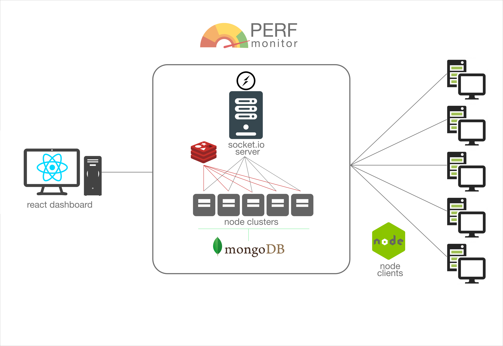

# PERFMonitor - Performance Monitoring System

### Introduction

PERFMonitor is a web application that shows you performance and problems of one or more server instances in near realtime. [socket.io](http://socket.io) is used for realtime data streaming and dashboard is built using react. PERFMonitor uses redis adapter to handle connection in socket.io and it also uses mongodb to store data.

<p align="center">
  
</p>

### Stack

- NodeJS - backend server
- ReactJS - frontend ui framework
- [Socket.io](http://socket.io) - for realtime data transferring
- Redis - in memory database
- MongoDB - database

### Architecture

several node clients can be installed in multiple servers and they can communicate with out [socket.io](http://socket.io) server. these node clients essentially send their servers performance data as an object. to make this project scalable in the socket server I used node cluster module to distribute requests coming from individual node client. and I've used redis adapter as an a in memory database to handle any issues when using cluster module and socket together. finally socket server will send data in 1 second intervals to out react frontend making this near realtime performance monitoring system.

<p align="center">
  
</p>

## Setting Up

### Prerequisite

- node
- npm or yarn

### setting up redis

install redis and run redis before running the [socket.io](http://socket.io) node server

```jsx
wget https://download.redis.io/releases/redis-6.2.5.tar.gz
tar xzf redis-6.2.5.tar.gz
cd redis-6.2.5
make

cd ./src/redis-server
```

### setting up node client

```jsx

git clone https://github.com/dulajkavinda/performance.git
cd node-client

yarn install
yarn start
```

- you can access the node client from port localhost:8181

### setting up [socket.io](http://socket.io) node server

```jsx
git clone https://github.com/dulajkavinda/performance.git
cd server

yarn install
yarn start
```

- set your MongoDB url in here,

```jsx
mongoose.connect("mongodb://127.0.0.1/perfData", { useNewUrlParser: true });
```

### setting up react client

```jsx
https://github.com/dulajkavinda/performance.git
cd client 

yarn install
yarn start
```

- go to localhost:3000

### How to Contribute

Got ideas on how to make this better? Open an issue [here!](https://github.com/dulajkavinda/performance/issues)
Issues, Pull Requests and all Comments are welcome!

### License

MIT © [dulajkavinda](https://github.com/dulajkavinda/performance/blob/master/LICENSE)
